# 📊💬 Azure Excel Chat [](https://deepwiki.com/vladimir-90/azure-openai-excel__dotnet-react-openai)

**Chat with your Excel files using natural language powered by Azure OpenAI!**

Forked from https://github.com/donpotts/AzureExcelChat

SemanticKernel:
    https://learn.microsoft.com/en-us/semantic-kernel/overview/
    https://github.com/microsoft/semantic-kernel/tree/main/dotnet


## 💭 Example Queries

Try these natural language questions with your Excel data:

### 🏢 **Department Queries**
- "Who are the engineers?"
- "Show me the Sales team"
- "List all HR employees"
- "How many people work in Marketing?"

### 💰 **Salary Analysis**
- "Who earns more than $90,000?"
- "What's the average salary?"
- "Who has the highest salary?"
- "Show me employees earning between $70,000 and $100,000"

### 📅 **Date Filtering**
- "Who was hired in 2022?"
- "Show recent hires"
- "List employees hired before 2021"

### 📊 **Statistics**
- "How many people work in each department?"
- "What's the average salary by department?"
- "Who are the top 3 earners?"

### 🔍 **General Queries**
- "List all employees"
- "Show me everyone's information"
- "Give me a summary of the data"


## 🔧 How It Works

The application follows a simple, two-step RAG (Retrieval-Augmented Generation) pattern:

```mermaid
graph TD
    A[❓ User Question] --> B[🧠 Azure OpenAI Analysis]
    B --> C[📝 Query Description]
    C --> D[📊 Excel File Parsing]
    D --> E[🔍 Data Filtering]
    E --> F[💭 Answer Generation]
    F --> G[💬 Natural Language Response]
```



1. **Step 1: Query Analysis** - Converts your question into a filtering strategy using your Excel schema
2. **Step 2: Data Retrieval & Response** - Filters the Excel data and generates a friendly, natural language answer


## RAG

Extend the `FilterDataBasedOnQuery` to apply custom data pre-filtration rules:
```csharp
// Example: Position-based filtering
else if (query.Contains("manager") || query.Contains("senior") || description.Contains("position"))
{
    includeRow = row.Count > 5 && row[5]?.ToString()?.ToLower().Contains("manager") == true;
}
```


### Custom Excel File Structure

1. **Update Schema**: Modify `GetExcelSchema()` to reflect your data structure
2. **Adjust Sample Data**: Update `SetupExcelFile()` with your sample data
3. **Update Filtering**: Modify `FilterDataBasedOnQuery()` for your columns
4. **Column Mapping**: Adjust column indices throughout the code


## 📊 Sample Data & Data Structure

| Id | Name | Department | Salary | HireDate |
|----|------|------------|--------|----------|
| 1 | Alice Johnson | Engineering | $95,000 | 2022-01-15 |
| 2 | Bob Smith | Sales | $82,000 | 2021-11-30 |
| 3 | Charlie Brown | Engineering | $110,000 | 2020-05-20 |
| 4 | Diana Prince | Sales | $78,000 | 2022-08-01 |
| 5 | Eve Adams | HR | $65,000 | 2023-02-10 |
| 6 | Frank Wilson | Marketing | $72,000 | 2021-09-15 |
| 7 | Grace Liu | Engineering | $103,000 | 2023-01-20 |
| 8 | Henry Davis | Sales | $85,000 | 2022-03-12 |
| 9 | Ivy Chen | HR | $70,000 | 2020-12-05 |
| 10 | Jack Miller | Marketing | $68,000 | 2023-05-18 |


## Cost & response time optimization:

- use cheaper AI model (rule of thumb - start with most capable model and later go down)
- caching for repeated queries
- optimize prompts
- "max-tokens" parameter reduces costs and response time

- filter data before AI procesing, if possible (FilterDataBasedOnQuery ???)
- implement column selection (to send relevant data only)
