# 📊💬 Azure Excel Chat

**Chat with your Excel files using natural language powered by Azure OpenAI!**

[](https://dotnet.microsoft.com/)
[](https://azure.microsoft.com/en-us/products/ai-services/openai-service)
[](https://learn.microsoft.com/en-us/semantic-kernel/)
[](https://github.com/ClosedXML/ClosedXML)

> Transform your Excel spreadsheets into conversational insights! Ask questions about your Excel data in plain English and get intelligent responses powered by Azure OpenAI.


## ✨ Features

🗣️ **Natural Language Queries** - Ask questions like "Who are the engineers?" or "What's the average salary in Sales?"

🤖 **Azure OpenAI Integration** - Leverages Azure OpenAI Service (GPT-4) for intelligent data interpretation

🔗 **Two-Step RAG Pipeline** - Ensures AI answers are grounded in real data from your Excel files

⚙️ **Auto-Setup** - Automatically creates and populates sample data in Excel format

🔐 **Secure Configuration** - Uses .NET User Secrets for secure API key storage

⚡ **Real-time Processing** - Instant responses with live Excel data parsing

📁 **Local Files** - Works with local Excel files (.xlsx format)

🎨 **Beautiful Console Interface** - Rich console output with emojis and formatting

## 🔧 How It Works

The application follows a simple, two-step RAG (Retrieval-Augmented Generation) pattern:

```mermaid
graph TD
    A[❓ User Question] --> B[🧠 Azure OpenAI Analysis]
    B --> C[📝 Query Description]
    C --> D[📊 Excel File Parsing]
    D --> E[🔍 Data Filtering]
    E --> F[💭 Answer Generation]
    F --> G[💬 Natural Language Response]
```



1. **Step 1: Query Analysis** - Converts your question into a filtering strategy using your Excel schema
2. **Step 2: Data Retrieval & Response** - Filters the Excel data and generates a friendly, natural language answer

## 🎬 Demo

Here's what a typical session looks like:

```bash
📊💬 Azure Excel Chat
════════════════════════════════════════
Chat with your Excel files using natural language powered by Azure OpenAI!

⚙️ Setting up Excel file...
✅ Created new worksheet: Employees
📊 Excel file 'Employees' populated with sample data
📍 File location: G:\repos\AzureExcelChat\employees.xlsx

📋 Excel Schema:
📋 Excel Worksheet Structure:
════════════════════════════════════════
Worksheet Name: Employees
Columns:
- A: Id (INTEGER) - Employee ID number
- B: Name (TEXT) - Employee full name  
- C: Department (TEXT) - Department (Engineering, Sales, HR, Marketing)
- D: Salary (INTEGER) - Annual salary in USD
- E: HireDate (TEXT) - Date hired (YYYY-MM-DD format)

💬 Chat with your Excel file! Type 'exit' to quit.
════════════════════════════════════════

🤖 > Who are the engineers?

🔍 Query Analysis: Filter employees where Department column contains 'Engineering' and return their names, IDs, and salaries.
📊 Excel Data Retrieved:
```
Id	Name	Department	Salary	HireDate
1	Alice Johnson	Engineering	95000	2022-01-15
3	Charlie Brown	Engineering	110000	2020-05-20
7	Grace Liu	Engineering	103000	2023-01-20
```

💡 Answer: The engineers in the company are Alice Johnson (ID: 1, Salary: $95,000), Charlie Brown (ID: 3, Salary: $110,000), and Grace Liu (ID: 7, Salary: $103,000).

════════════════════════════════════════

🤖 > What is the average salary in the Sales department?

🔍 Query Analysis: Filter employees where Department is 'Sales' and calculate the average of their Salary values.
📊 Excel Data Retrieved:
```
Id	Name	Department	Salary	HireDate
2	Bob Smith	Sales	82000	2021-11-30
4	Diana Prince	Sales	78000	2022-08-01
8	Henry Davis	Sales	85000	2022-03-12
```

💡 Answer: The average salary in the Sales department is $81,667. This is calculated from three employees: Bob Smith ($82,000), Diana Prince ($78,000), and Henry Davis ($85,000).
```

## 📋 Prerequisites

Before you begin, ensure you have:

- [.NET 9 SDK](https://dotnet.microsoft.com/download/dotnet/9.0)
- [Azure OpenAI Service](https://azure.microsoft.com/en-us/products/ai-services/openai-service) resource
- A deployed GPT model (GPT-4 recommended, but GPT-3.5-turbo works too)

## 🚀 Quick Start

### 1. Clone and Setup

```bash
git clone https://github.com/donpotts/AzureExcelChat.git
cd AzureExcelChat
dotnet restore
```

### 2. Configure Azure OpenAI Credentials

The application uses .NET User Secrets to securely store your API keys:

```bash
# Initialize user secrets
dotnet user-secrets init

# Set your Azure OpenAI credentials
dotnet user-secrets set "AZURE_OPENAI_API_KEY" "your-azure-openai-api-key"
dotnet user-secrets set "AZURE_OPENAI_ENDPOINT" "https://your-resource.openai.azure.com/"
dotnet user-secrets set "AZURE_OPENAI_DEPLOYMENT_NAME" "your-gpt-4-deployment-name"

# Optional: Set custom Excel file path (defaults to ./employees.xlsx)
dotnet user-secrets set "EXCEL_FILE_PATH" "C:\path\to\your\custom\file.xlsx"
```

### 3. Get Your Azure OpenAI Credentials

1. **Create Azure OpenAI Resource**
   - Go to [Azure Portal](https://portal.azure.com/)
   - Create an Azure OpenAI resource
   - Note your endpoint URL (e.g., `https://your-resource.openai.azure.com/`)

2. **Deploy a Model**
   - In Azure OpenAI Studio, deploy a GPT model
   - Recommended: `gpt-4` or `gpt-35-turbo`
   - Note your deployment name

3. **Get API Key**
   - In Azure Portal, go to your OpenAI resource
   - Navigate to "Keys and Endpoint"
   - Copy one of the API keys

### 4. Run the Application

```bash
dotnet run
```

## 💭 Example Queries

Try these natural language questions with your Excel data:

### 🏢 **Department Queries**
- "Who are the engineers?"
- "Show me the Sales team"
- "List all HR employees"
- "How many people work in Marketing?"

### 💰 **Salary Analysis**
- "Who earns more than $90,000?"
- "What's the average salary?"
- "Who has the highest salary?"
- "Show me employees earning between $70,000 and $100,000"

### 📅 **Date Filtering**
- "Who was hired in 2022?"
- "Show recent hires"
- "List employees hired before 2021"

### 📊 **Statistics**
- "How many people work in each department?"
- "What's the average salary by department?"
- "Who are the top 3 earners?"

### 🔍 **General Queries**
- "List all employees"
- "Show me everyone's information"
- "Give me a summary of the data"

## 🏗️ Architecture & Technology Stack

### Core Technologies

| Component | Technology | Purpose |
|-----------|------------|---------|
| **AI Framework** | Microsoft Semantic Kernel 1.64.0 | AI orchestration and prompt management |
| **Language Model** | Azure OpenAI Service (GPT-4) | Natural language understanding and generation |
| **Data Source** | Excel Files (.xlsx) | Local spreadsheet data storage |
| **Excel Library** | ClosedXML 0.104.1 | Excel file reading and manipulation |
| **Runtime** | .NET 9.0 | Modern, high-performance application platform |
| **Configuration** | .NET User Secrets | Secure API key management |

### Key Components

- **Semantic Kernel**: Microsoft's AI orchestration framework for building AI applications
- **Azure OpenAI**: Enterprise-ready AI service with GPT models
- **ClosedXML**: Powerful .NET library for Excel file manipulation
- **Smart Filtering**: Context-aware data filtering based on AI analysis
- **User Secrets**: Secure credential storage for development

## ⚙️ Customization

### Switching GPT Models

Update your deployment to use different models:

```bash
# For GPT-4 (recommended for best results)
dotnet user-secrets set "AZURE_OPENAI_DEPLOYMENT_NAME" "gpt-4"

# For GPT-3.5-turbo (faster and more cost-effective)
dotnet user-secrets set "AZURE_OPENAI_DEPLOYMENT_NAME" "gpt-35-turbo"
```

### Adding Custom Query Types

Extend the `FilterDataBasedOnQuery` method in `Program.cs`:

```csharp
// Example: Position-based filtering
else if (query.Contains("manager") || query.Contains("senior") || description.Contains("position"))
{
    includeRow = row.Count > 5 && row[5]?.ToString()?.ToLower().Contains("manager") == true;
}
```

### Custom Excel File Structure

1. **Update Schema**: Modify `GetExcelSchema()` to reflect your data structure
2. **Adjust Sample Data**: Update `SetupExcelFile()` with your sample data
3. **Update Filtering**: Modify `FilterDataBasedOnQuery()` for your columns
4. **Column Mapping**: Adjust column indices throughout the code

### Environment-Specific Configuration

For production deployments, you can use environment variables instead of user secrets:

```bash
# Environment variables (production)
export AZURE_OPENAI_API_KEY="your-key"
export AZURE_OPENAI_ENDPOINT="https://your-resource.openai.azure.com/"
export AZURE_OPENAI_DEPLOYMENT_NAME="your-deployment"
export EXCEL_FILE_PATH="/path/to/production/file.xlsx"
```

## 📊 Sample Data Structure

The application creates this sample employee dataset:

| Id | Name | Department | Salary | HireDate |
|----|------|------------|--------|----------|
| 1 | Alice Johnson | Engineering | $95,000 | 2022-01-15 |
| 2 | Bob Smith | Sales | $82,000 | 2021-11-30 |
| 3 | Charlie Brown | Engineering | $110,000 | 2020-05-20 |
| 4 | Diana Prince | Sales | $78,000 | 2022-08-01 |
| 5 | Eve Adams | HR | $65,000 | 2023-02-10 |
| 6 | Frank Wilson | Marketing | $72,000 | 2021-09-15 |
| 7 | Grace Liu | Engineering | $103,000 | 2023-01-20 |
| 8 | Henry Davis | Sales | $85,000 | 2022-03-12 |
| 9 | Ivy Chen | HR | $70,000 | 2020-12-05 |
| 10 | Jack Miller | Marketing | $68,000 | 2023-05-18 |

## 🔒 Security Best Practices

- 🔐 **User Secrets**: API keys are stored securely using .NET User Secrets
- ❌ **No Hardcoded Credentials**: All sensitive data is externalized
- 🌍 **Environment Variables**: Support for production environment configuration
- 📁 **Local Files**: Excel files are processed locally, ensuring data privacy
- 🛡️ **Minimal Permissions**: Application only requires file system access

## 🔧 Troubleshooting

### Common Issues & Solutions

| Issue | Solution |
|-------|----------|
| **"AZURE_OPENAI_API_KEY is not set"** | Run: `dotnet user-secrets set "AZURE_OPENAI_API_KEY" "your-key"` |
| **"AZURE_OPENAI_ENDPOINT is not set"** | Run: `dotnet user-secrets set "AZURE_OPENAI_ENDPOINT" "your-endpoint"` |
| **"AZURE_OPENAI_DEPLOYMENT_NAME is not set"** | Run: `dotnet user-secrets set "AZURE_OPENAI_DEPLOYMENT_NAME" "your-deployment"` |
| **"Error reading Excel file"** | Ensure Excel file isn't open in another application |
| **"Authorization failed"** | Verify your Azure OpenAI API key and endpoint are correct |
| **"Model not found"** | Ensure your deployment name matches exactly |

### Debug Steps

1. **Verify Configuration**: Check user secrets with `dotnet user-secrets list`
2. **Test Azure OpenAI**: Ensure your Azure OpenAI resource is properly configured
3. **Check File Permissions**: Ensure the application can read/write Excel files
4. **Review Logs**: Check console output for specific error messages
5. **Validate Deployment**: Confirm your GPT model deployment is active

### Getting Help

If you encounter issues:

1. **Check Azure OpenAI Status**: Visit [Azure Status Page](https://status.azure.com/)
2. **Review Documentation**: [Azure OpenAI Documentation](https://docs.microsoft.com/en-us/azure/cognitive-services/openai/)
3. **Open an Issue**: Create a GitHub issue with error details and configuration (without secrets)

## ⚡ Performance Optimization

### Response Speed
- Use `gpt-35-turbo` for faster responses
- Reduce `max_tokens` in prompt settings for shorter responses
- Filter Excel data before sending to AI to reduce token usage

### Cost Optimization
- Use `gpt-35-turbo` instead of `gpt-4` for cost savings
- Implement caching for repeated queries
- Optimize prompts to reduce token consumption

### Large Excel Files
- Consider pagination for files with thousands of rows
- Implement column selection to focus on relevant data
- Use Excel filtering before AI processing

### Development Guidelines

- Follow .NET coding conventions
- Add unit tests for new features
- Update documentation for any changes
- Ensure all tests pass before submitting PR

## 🙏 Acknowledgments

- **[Microsoft Semantic Kernel](https://github.com/microsoft/semantic-kernel)** - AI orchestration framework
- **[Azure OpenAI Service](https://azure.microsoft.com/en-us/products/ai-services/openai-service)** - Enterprise AI capabilities
- **[ClosedXML](https://github.com/ClosedXML/ClosedXML)** - Excel file manipulation
- **[.NET Foundation](https://dotnetfoundation.org/)** - .NET ecosystem and tools

## ⭐ Show Your Support

If you find this project helpful, please consider:

- ⭐ **Starring this repository**
- 🐛 **Reporting bugs** or suggesting features
- 📢 **Sharing** with others who might benefit

## 📧 Contact

**Don Potts** - [Don.Potts@DonPotts.com](mailto:Don.Potts@DonPotts.com)

---

<div align="center">

**🚀 Transform your Excel spreadsheets into intelligent conversations today! 📊**

</div>